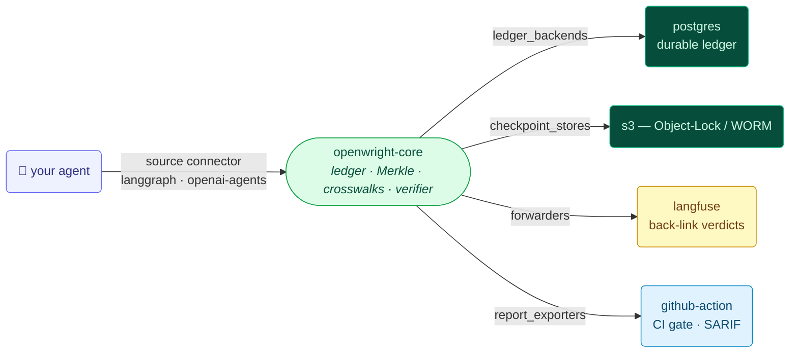

<h1 align="center">🔌 OpenWright Connectors</h1>

<p align="center">Modular, independently-installable connectors for
<a href="https://github.com/allthingsN/openwright"><b>OpenWright</b></a> — the agent evidence layer.</p>

<p align="center">
  <a href="LICENSE"></a>
  <a href="https://github.com/allthingsN/openwright-connectors/actions"></a>
  <a href="https://github.com/allthingsN/openwright"></a>
</p>

Connectors plug into core through the stable `openwright.connectors` contract (v1.0) and
**entry points** — so `openwright.instrument("langgraph")` and `openwright connectors list`
discover them automatically. **Core never depends on a connector**: adding or removing one
needs zero core change, and a connector never imports another connector (enforced in CI).



## Packages

| Package | Type | What it does |
|---|---|---|
| [`openwright-langgraph`](packages/openwright-langgraph) | source | Capture LangGraph agent decisions, tools, and human-in-the-loop approvals as evidence. |
| [`openwright-openai-agents`](packages/openwright-openai-agents) | source | Same, for the OpenAI Agents SDK (one-line `instrument("openai-agents")`). |
| [`openwright-langfuse`](packages/openwright-langfuse) | forwarder | Co-ingest to Langfuse + back-link `openwright:*` verdicts. |
| [`openwright-postgres`](packages/openwright-postgres) | storage | Durable, multi-writer PostgreSQL ledger backend. |
| [`openwright-s3`](packages/openwright-s3) | storage | S3 checkpoint store with Object-Lock / WORM chain-of-custody. |
| [`openwright-github-action`](packages/openwright-github-action) | exporter | CI evidence gate: fail the build on unsatisfied controls + upload SARIF. |
| [`_template`](packages/_template) | — | Copy-to-start a new connector. |

## Quickstart

```bash
pip install openwright-core openwright-langgraph openwright-langfuse openwright-postgres
openwright connectors list                 # see what's installed
examples/lending-agent/run_local.sh        # capture → evidence → verify → (Langfuse) → CI gate
```

See [`examples/lending-agent/`](examples/lending-agent) for the flagship demo composing the
connectors end-to-end, and [openwright-examples](https://github.com/allthingsN/openwright-examples)
for before/after integrations on real agents.

## Principles

- **Modular** — each `packages/*` is an independently-publishable `openwright-<name>`
  distribution depending on `openwright-core>=0.6,<0.8` (the contract floor).
- **Decoupled** — a connector imports only the public `openwright` / `openwright.connectors`
  API, never another connector (enforced by `.importlinter` in CI).
- **Conformant** — every connector passes the shared conformance harness (`conformance/`):
  it implements its contract, registers its entry point, and preserves the invariants —
  **hashes-only** (no raw PII in events), **no crypto re-implementation** (call core),
  append-only, the boundary statement, and the additive (never-blocking) path.

Built on open surfaces (OTel, public APIs, framework hooks); **no partnership or endorsement**
is implied (Langfuse, AWS, OpenAI, GitHub). Contributions welcome — see [CONTRIBUTING.md](CONTRIBUTING.md).

> *OpenWright produces evidence that controls were exercised. It is not, and does not claim to
> be, a legal compliance certification.*
